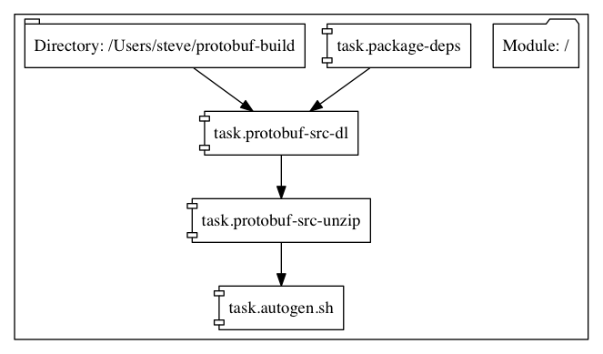
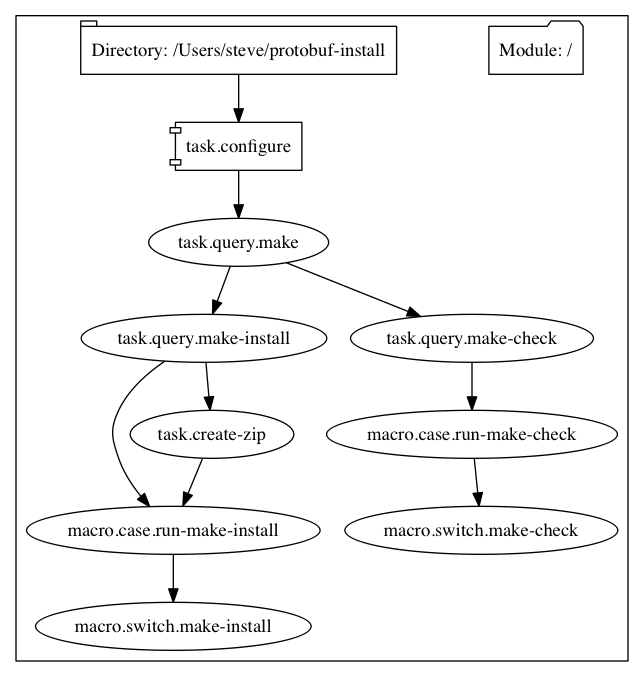

# protocol-buffers-arm
Protocol buffers build for Linux ARM systems

This sets up a debian-based Linux ARM system to compile
Google's [Protocol Buffers](http://github.com/google/protobuf). Since Google
currently does not have builds for Linux running on ARM chips and the build
cycle can take several hours, a binary releases are provided.

We use [converge](https://github.com/asteris-llc/converge) to manage system
configurations.

This can be used on a Raspberry Pi devices, or on C1 [scaleway](http://scaleway.com)
ARM-based systems.

### Downloading and Installing Binaries

Precompiled binares are available at the [releases](https://github.com/asteris-llc/protocol-buffers-arm/releases) page.


To install, unpack the zip file into a directory like `/usr/local`:

```shell

unzip protoc-3.1.0-linux-arm.zip

```

### Building From Source

Install converge onto your system. The install script will automatically
download a Linux ARM version of the binary:


```shell

curl -L https://raw.githubusercontent.com/asteris-llc/converge/master/install-converge.sh | sudo bash -


```

Once converge is installed, set up the build environment.


```shell

converge apply --local protobuf-setup.hcl

```

The setup module installs packages required to build Protocol Buffers, downloads the source and runs `autogen.sh`.



The build takes several hours:

```shell

converge apply --local protobuf-build.hcl

```



By default, the build directory is:

    {{env `HOME`}}/protobuf-build/protobuf-{{param `protobuf_version`}}
and the install directory is

    {{env `HOME`}}/protobuf-install/protobuf-{{param `protobuf_version`}}

These can be overridden using command line arguments to converge:

```shell

converge apply --local -p install_dir=/usr/local

```

## License

The configuration files are released under the Apache 2.0 license. See [LICENSE](LICENSE).

Binary and source releases of Protocol Buffers are released under the following [license](LICENSE.protobuf).
